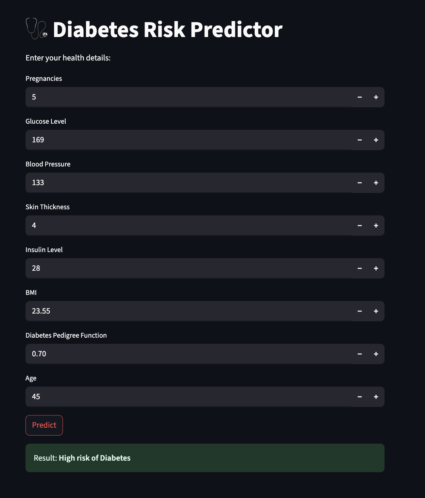
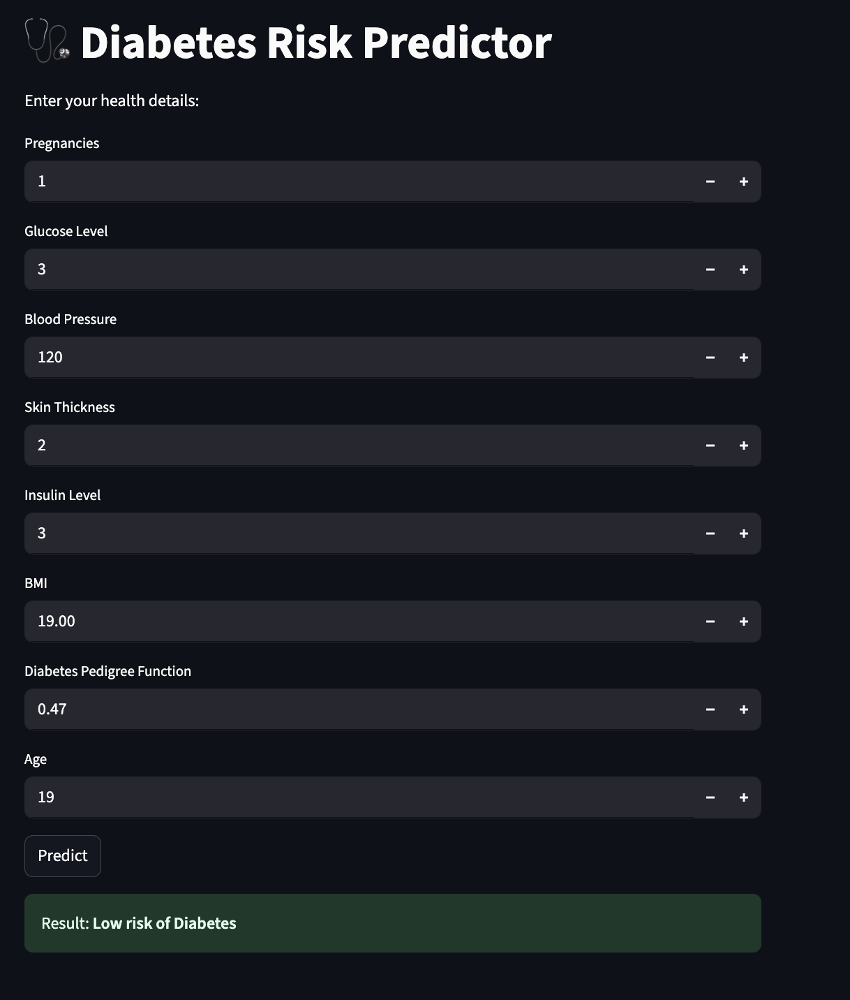

# 🩺 Diabetes Risk Predictor

This is a simple and impactful machine learning web app that predicts the risk of diabetes based on patient health inputs like glucose level, BMI, age, etc. It uses a trained **Random Forest Classifier** on the PIMA Indian Diabetes dataset and is deployed using **Streamlit**.

---

## 🔍 Features

- Takes 8 medical parameters as input (Pregnancies, Glucose, BMI, etc.)
- Predicts whether the patient is **at risk of diabetes**
- Simple and interactive web UI using Streamlit
- Built with beginner-friendly ML stack (pandas, scikit-learn, numpy)

---

## 🖥️ Screenshot of the App






---

## 🧠 Tech Stack

| Component       | Library        |
|----------------|----------------|
| Model Training | scikit-learn   |
| Web Interface  | Streamlit      |
| Data Handling  | pandas, numpy  |
| Language       | Python 3.10+   |

---

## 🧪 Dataset

- PIMA Indian Diabetes dataset  
- Publicly available from [Kaggle](https://www.kaggle.com/datasets/uciml/pima-indians-diabetes-database) or [UCI ML Repo](https://archive.ics.uci.edu/ml/datasets/pima+indians+diabetes)

---

## 🚀 How to Run Locally

### 1. Clone or Download

```bash
git clone https://github.com/your-username/diabetes-predictor.git
cd diabetes-predictor
